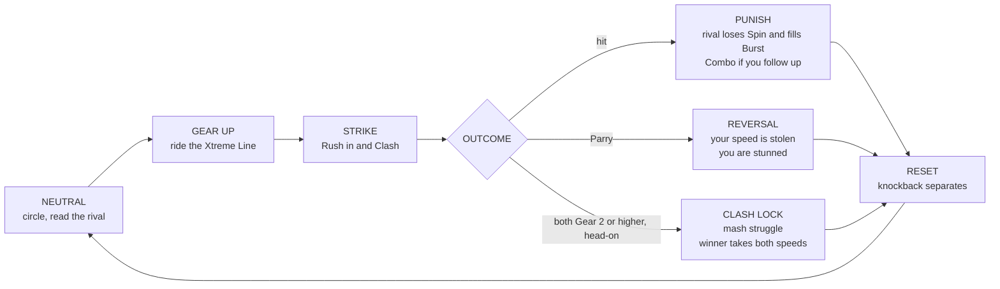

# 01 · MDA: from feeling to rules

> MDA says the designer builds **Mechanics → Dynamics → Aesthetics**, but the player meets them in the opposite order: **Aesthetics → Dynamics → Mechanics** (Hunicke et al., *MDA as Lens*). So we start with what the player feels, which is currently wrong.

---

## 1. Diagnosis: why the current prototype "makes no sense"

We read the current build through the MDA lenses: what the player **feels** (A), what actually **happens** (D), and which **rule** causes it (M). The numbers come from the headless balance harness (`npm run balance`).

| # | What the player feels (A) | What happens (D) | Mechanic that causes it (M) |
|---|---|---|---|
| 1 | "When does it start?" | It takes seconds of setup before anything moves | The Launcher is a separate phase: first the Rip Meter oscillates, then you aim, then you release |
| 2 | "I'm not really controlling it" | Your input is one force among several, so the Bey drifts where it likes | Steering is an acceleration that competes with the bowl force, the Tornado Ridge's tangential force and friction |
| 3 | "It just… stopped?" | **64% of Rounds end in a Spin Finish.** Both Beys circle while their Spin runs out. | Spin mostly **decays on its own** (static friction). Clashes move only a little of it. |
| 4 | "Why did I lose that hit?" | Clash results seem random | Clash math is hidden behind Bey Type matchup tables, Burst Stress and weight ratios, and none of it is shown |
| 5 | "What do I do when it attacks me?" | You can only run away | There is **no defensive verb**, so there are no reads, no mind games and no counterplay |
| 6 | "What does my Special Move do?" | The Special Move has no identity | Special Moves are effect multipliers with no visible shape and no fantasy |
| 7 | "This is dragging" | Tension stays flat until the Spin timer runs out | Nothing escalates, so a Round's second half plays exactly like its first |

**Root cause:** the game's economy has **one resource (Spin) and one main drain (time)**. Adams & Dormans would call this **static friction with no engine**. Nothing the player earns can be spent, so choices carry no weight. The fix is a second resource that the player **builds up and spends**, and that is Velocity.

---

## 2. Aesthetics: the target feelings

We use the eight kinds of fun from MDA, ranked the way the paper ranks *Quake* ("Challenge, Sensation, Competition, Fantasy").

| Rank | Aesthetic | What it means here | We know it works when… |
|---|---|---|---|
| 1 | **Sensation** (game as sense-pleasure) | Speed, impact, fire. Every hit **lands**: hit-stop, shake, sparks, a callout. | Someone watching over your shoulder goes "ooh" |
| 2 | **Challenge** (game as obstacle course) | Fighting-game reads: Rush, or Guard, or Parry? Rail timing. | Players say "I should have guarded" instead of "that was random" |
| 3 | **Fantasy** (game as make-believe) | An anime Blader showdown: Special Move cut-ins, Clash Lock struggles, comebacks | Players shout the Special Move's name |
| 4 | **Competition** | It's always clear who is winning and why | A glance at the HUD tells you who is ahead |
| — | Narrative, Discovery, Expression, Fellowship, Submission | **Out of scope** for this loop | — |

### Design pillars (ADHD-friendly)

1. **There is always something to press.** Rush is never on cooldown; repeating it only costs more (Rush Heat). No state lasts longer than 1.5 s without a meaningful input.
2. **Readable at a glance.** Each Bey shows three bars: Spin, Burst and Special. Velocity isn't a bar; you see it **on the Bey** as its Gear. Nothing that matters is hidden.
3. **Loud, instant feedback.** Every hit gets hit-stop, shake, particles and text within 100 ms, and all of it grows with Gear. A Gear 3 hit freezes the frame.
4. **Short loops.** An exchange lasts 2–4 s, a Round 15–45 s and a Match under 3 min. The countdown to Rip takes 3 s. A rematch is one tap away.
5. **Low floor, high ceiling.** Mashing Rush half-works. Mastery means riding the Xtreme Line to Gear 3, Parrying on reads and baiting Clash Locks.
6. **No hidden math.** *Faster means harder.* Damage, Burst fill and knockback all grow with Velocity, and a child can predict that.

---

## 3. Dynamics: what should happen in play

MDA: *"Dynamics work to create aesthetic experiences… challenge is created by things like time pressure and opponent play."* We design the behaviour at four time scales, each nested inside the next.

### 3.1 Moment (0.1–1 s)
Steer, feel the Bey take the rail, hit-stop on impact, the flash of the Parry window, the combo counter ticking up.

### 3.2 Exchange (2–4 s): the core loop
This mirrors a fighting game's **neutral → punish → reset** cycle:

Each branch of **Outcome** is a *read*:
- Rush into a Guard and the hit barely lands.
- Rush into a Parry and you lose your speed.
- Rush while they are still gearing up and you win the exchange.

That triangle of choices is what makes it feel like a fighting game rather than a physics toy.

### 3.3 Round (15–45 s)
Spin and Burst are worn down over repeated exchanges. At 30 s **Overdrive** begins: the Over Zones widen and Spin decays faster, so any stalled Round is forced to a Finish. **Last Stand** gives a Bey on low Spin one dramatic comeback window. The Round ends in a Spin, Over, Burst or Xtreme Finish.

### 3.4 Match (1–3 min)
The first Blader to 4 points wins. With finishes worth 1–3 points, a Match lasts 2–4 Rounds. The Special Gauge **carries over** between Rounds, fighting-game style, which quietly favours whoever just lost (more in [03](03-feedback-loops.md)).

### 3.5 Signature moments (emergent, but designed for)
| Moment | How it emerges | Aesthetic |
|---|---|---|
| **Clash Lock** | Two Beys meet head-on, both at Gear 2 or higher. Time slows, "CLASH!" appears and both Bladers mash Rush for about 1.2 s. The winner turns **both** Velocities into one strike. | Fantasy, Sensation |
| **Parry reversal** | A predictable Rush is read, and the attacker is stunned and slowed | Challenge |
| **Last Stand** | Spin drops below 25% and the screen flashes. Burst clears, the Special Gauge surges and the Bey gets faster. | Fantasy, Competition |
| **Xtreme Finish** | A Gear 3 hit sends the rival through an Over Zone, for 3 points | Sensation |
| **Special Move cut-in** | The frame freezes, a portrait slides in and the ability fires | Fantasy |

### 3.6 Dynamics we must prevent
Taken from the MDA paper's Monopoly analysis ("the gap widens… dramatic tension and agency are lost").

| Anti-dynamic | Symptom | Guard against it (see [03](03-feedback-loops.md)) |
|---|---|---|
| **Runaway leader** | The first Blader to land a hit wins the Round | N2 hit recoil, N3 comeback meter, N4 combo scaling, N9 Last Stand |
| **Stalemate / waiting** | Both Beys circle without touching | N11 Overdrive, the Stadium bowl pulling both inward, Spin decay |
| **Turtling** | Holding Guard forever | N7 Guard time cap, Guard draining your own Velocity |
| **Rush spam** | Mashing Rush is the best strategy | N6 Rush Heat, N8 Parry |

---

## 4. Mechanics: the rules that produce it

The full diagrams are in [02-machinations.md](02-machinations.md) and the numbers are in [04-tuning-and-data.md](04-tuning-and-data.md).

### 4.1 Resources
| Resource | Role | Fighting-game analogue | Shown as |
|---|---|---|---|
| **Spin** | Life. At 0 it's a Spin Finish. | Health bar | A top bar, with RPM text |
| **Velocity** | **The economy.** Earned by moving, spent by hitting. | Meter and positioning in one | A Gear (0–3) shown on the Bey: trail colour, then flames |
| **Burst Gauge** | Guard-crush. When full, it's a Burst Finish. | Stun / guard meter | A thin bar under Spin |
| **Special Gauge** | Enables the Special Move | Super meter | A bar that pulses when full |

Why Velocity? It is the one quantity a spinning top **visibly has** and that everyone reads correctly: a faster Bey hits harder. It already exists in the simulation (battle's body table). Making it the currency turns the physics into the economy, rather than bolting points on top.

### 4.2 Verbs (controls)
| Verb | Keyboard | Touch | Economic function |
|---|---|---|---|
| **Steer** | WASD / arrows | Joystick | Static engine: Velocity up to Gear 1 |
| **Rush** | Shift / J | RUSH button | Converter: Spin → Velocity |
| **Guard** (hold) / **Parry** (timed) | Space / K | GUARD button | A drain on your own Velocity / a trader that takes the attacker's Velocity |
| **Special Move** | E / L | SPECIAL button (pulses when ready) | Converter: Special Gauge → ability |
| **Rip** | Press Rush on the "RIP!" beat of the countdown | Drag back, release on "RIP!" | Source: Spin, plus Velocity on a Perfect Rip |

That's three action buttons plus movement, the same count as a Brawl Stars-style mobile brawler.

### 4.3 Rule summary
| Mechanic | Rule | Machinations function | Pattern (Adams & Dormans, Ch. 7) |
|---|---|---|---|
| **Rip** | One gesture timed to "3-2-1 LET IT RIP". Good = 90 Spin; Perfect = 100 Spin **and** a Gear 2 start. | Source | — |
| **Steering** | Accelerates toward the stick direction; speed from steering alone is capped at Gear 1 | Source (static engine) | Static Engine |
| **Xtreme Line** | At Gear 1 or higher you **latch** onto the rail and gain Velocity every second while you ride it | Gate → Source | Dynamic Engine |
| **Drag** | Velocity decays in proportion to itself | Drain (dynamic) | Dynamic Friction |
| **Rush** | Pay Spin and get an instant Velocity burst. Each repeat within 2 s costs more. | Converter | Converter + Stopping Mechanism |
| **Clash** | The faster Bey's Velocity along the collision normal becomes the defender's Spin loss, Burst fill and knockback. The attacker keeps 35% of its Velocity. | Converter | Attrition |
| **Combo** | Hits within 1.2 s of each other chain. The counter rises (Sensation) but each hit's damage scales 100 / 80 / 65 / 50%. | State modifier | Stopping Mechanism |
| **Guard** | Hold for up to 1.5 s. Your Velocity drains fast and you take ×0.4 damage, ×0.5 Burst and ×0.5 knockback. Then a 1 s cooldown. | Drain (own Velocity) | Static Friction (self-imposed) |
| **Parry** | Guard started within 0.15 s before a hit: no damage, you **take 80%** of the attacker's Velocity, the attacker is stunned for 0.4 s and you gain Special | Trader | Attrition (reversed) |
| **Clash Lock** | Head-on with both Beys at Gear 2 or higher: a slow-motion mash for 1.2 s. The winner strikes with both Beys' combined Velocity. | Gate ([skill] + [mp]) | — |
| **Burst Gauge** | Filled by hard hits and ×0.5 while Guarding. Starts draining 1.5 s after the last hit. | Pool with a drain | Dynamic Friction |
| **Special Gauge** | +8 per hit you deal, **+12 per hit you take**, +25 per Parry, +3/s while riding at Gear 3. Carries over between Rounds. | Pool fed by several sources | Multiple Feedback |
| **Special Move** | Spends the full gauge on the Bey's ability (below) | Converter | — |
| **Wobble** | At low Spin, steering and knockback resistance drop | State modifier | — |
| **Last Stand** | Once per Round, when Spin drops below 25%: Burst clears, +50 Special, Velocity gain ×1.3 for 5 s | Source (one-shot) | Stopping Mechanism (on the death spiral) |
| **Overdrive** | At 30 s into a Round: Spin decay ×2.5, Over Zones ×1.5 wider | Escalation | Escalating Challenge |
| **Finishes** | Spin 1 · Over 2 · Burst 2 · **Xtreme 3** (an Over Finish from a Gear 3 hit). First to 4 points wins. | End conditions | — |

### 4.4 Bey Types as fighting-game archetypes
Each Bey Type gets a playstyle and passives you can **see** on the Bey Select card. The Special Moves turn today's multipliers into **abilities with a shape**.

| Bey | Type | Archetype | Passive (shown on card) | Special Move (ability) |
|---|---|---|---|---|
| Tempest Drake | Attack | **Rushdown** | Faster rail acceleration; Rush Heat builds more slowly | **Tempest Rush**: three chained, homing Rushes, each one a Gear 3 hit |
| Iron Bastion | Defense | **Tank / Parry** | Wider Parry window; less knockback taken | **Bastion Wall**: a 3 s stance where every hit is auto-Parried |
| Lunar Wisp | Stamina | **Sustain** | Low Spin decay; regains Spin while riding the rail | **Lunar Siphon**: for 4 s, each hit **steals** Spin (a trader) |
| Crimson Viper | Balance | **All-rounder** | No weakness; Special Gauge fills a little faster | **Viper Smash**: pulls the rival in with a hook, then lands a guaranteed Gear 3 hit |

### 4.5 What gets removed or simplified
- **The Rip Meter's separate phase is removed.** Aim and power become one drag gesture timed to the countdown.
- **The Tornado Ridge's tangential force** is replaced by the Xtreme Line, a rail you choose to ride instead of a force that pushes you around.
- **Hidden Clash matchup tables** are removed from the moment-to-moment game. Matchups now come from visible passives.
- **Spin decay stops being the main way Rounds end.** It becomes a slow background timer that only bites during Overdrive.
