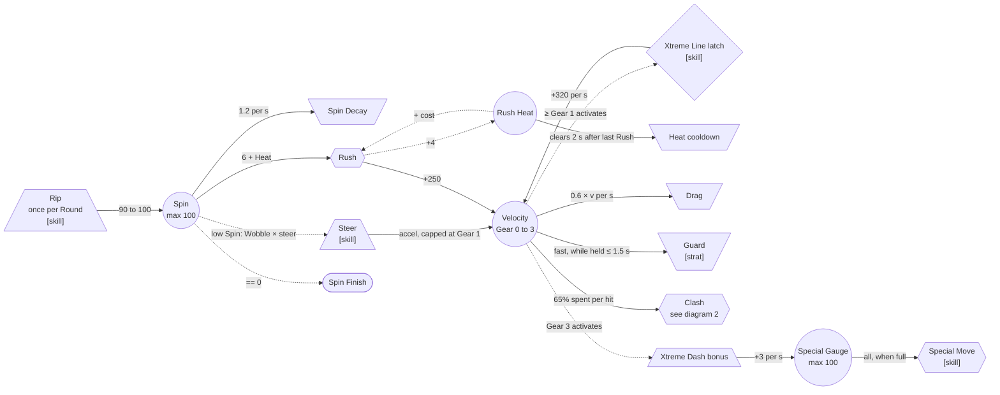
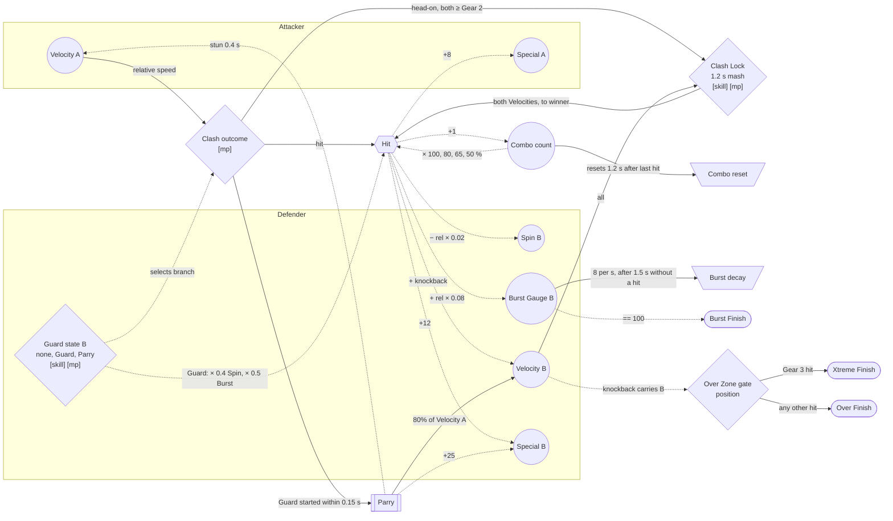
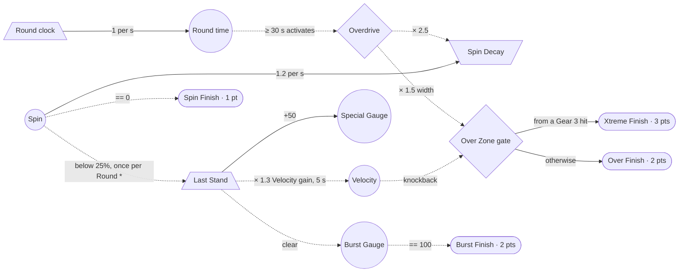
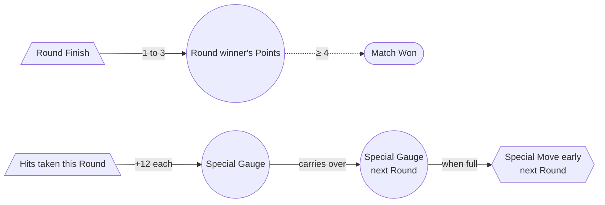

# 02 · Machinations: the economy

> Adams & Dormans (Ch. 4, *Internal Economy*) describe an economy as resources plus the rules that move them, through **four economic functions**:
> - **sources** create resources
> - **drains** destroy them
> - **converters** turn one resource into another
> - **traders** move resources between owners without creating any
>
> Every mechanic in this design is one of the four.

The legend for node shapes and arrows is in the [README](README.md#how-to-read-the-diagrams). In short:
- `(( ))` pool
- `[/ \]` source
- `[\ /]` drain
- `{{ }}` converter
- `{ }` gate
- `[[ ]]` trader
- `([ ])` end condition
- a solid arrow is a resource flow; a dotted arrow is a state connection

---

## 0. The economy at a glance

| Resource | Sources (in) | Drains (out) | Converters / traders | End condition |
|---|---|---|---|---|
| **Spin** | Rip · Lunar Siphon (trader) · Lunar Wisp riding the rail | Spin Decay · being hit · Rush cost | Rush (Spin → Velocity) | Spin = 0 → **Spin Finish** |
| **Velocity** | Steering (up to Gear 1) · Xtreme Line (past Gear 1) · Rush · Perfect Rip | Drag · Guard · Clash (spent on the hit) · Wall hits | Clash (Velocity → rival's losses) · Parry (steals Velocity) · Clash Lock (pools both Beys' Velocity) | Knocked through an Over Zone → **Over / Xtreme Finish** |
| **Burst Gauge** | Being hit (scales with the attacker's speed) | Decay once no hit lands for 1.5 s · Last Stand clears it | — | Full → **Burst Finish** |
| **Special Gauge** | Hits dealt · hits taken (more) · Parry · riding at Gear 3 · Last Stand | Spent in full | Special Move (Special Gauge → ability) | — |
| **Points** | Finishes (1 / 2 / 2 / 3) | — | — | 4 or more → **Match Won** |

---

## 1. One Bey's economy: Spin ⇄ Velocity

This is the heart of the design. Spin is what you **have**, Velocity is what you **spend**, and **Rush** is the converter between them.

**How to read it**
- **Two engines feed Velocity**:
  - a **static engine**: steering, which is always on but capped at Gear 1
  - a **dynamic engine**: the Xtreme Line. It only opens (the gate) once you are already moving at Gear 1, and it pays out for as long as you ride it. Speed buys the rail, and the rail buys more speed. That is loop **P1** in [03](03-feedback-loops.md).
- **Rush is the panic button and the burst option.** It turns life into speed right now. Rush Heat is a **stopping mechanism**: each repeat within 2 s costs 4 more Spin.
- **Drag is dynamic friction.** It grows with Velocity, so there is a natural top speed where the rail's gain equals Drag. Past that point only Rush, a Parry or a Clash Lock pushes you higher, for a moment.
- **Guard is a drain you choose.** You give up your own speed to be hard to hurt.

---

## 2. The Clash exchange: attacker → defender

The Clash is where Velocity is **spent**. The attacker is whichever Bey has more Velocity along the collision normal. The defender's **Guard state** chooses which branch the gate takes: that is the fighting-game read.

**How to read it**
- **Hit** is a **converter**. It consumes 65% of the attacker's Velocity and, through node modifiers, turns it into the defender's losses:
  - Spin taken away
  - Burst Gauge added
  - knockback Velocity added
  It also pays Special to **both** sides, the defender more.
- **Parry** is a **trader**. Nothing is created: the attacker's Velocity changes owner. This is **attrition reversed**, where the aggressor's own resource becomes the defender's weapon.
- **Clash Lock** is a **gate** with skill and multiplayer determinability. Both Beys pour their Velocity into it, and the mash winner receives the combined total as one Hit. It's the anime beam struggle.
- The **Combo** pool is a **stopping mechanism**. Every hit in a chain adds to the count, and the count scales damage *down*, while the on-screen number goes *up* to feed Sensation.

---

## 3. The Round: escalation and end conditions

A Round must end within about 45 s. **Overdrive** adds time pressure, the fix the MDA paper suggests for a Monopoly game that drags: mechanics that deplete resources over time to speed the game up. **Last Stand** keeps a losing Bey in the fight.

**How to read it**
- **Round time** is a pool filled by a source at a fixed rate. Past 30 s it **activates** Overdrive, which multiplies the Spin Decay drain and widens the Over Zone gate. This is **escalating challenge** tied to time rather than progress: the longer the Round, the easier it is for anything to finish it.
- **Last Stand** is a one-shot source, fired by a **trigger** (`*`). It aims straight at the destructive loop **P4** (low Spin → Wobble → more damage).
- The four end conditions pay **different amounts**. Aggressive finishes (Over, Burst, Xtreme) are worth more than waiting (Spin), so aggression is the dominant *direction* while Parry keeps it from being the dominant *strategy*.

---

## 4. The Match: points and carry-over

**How to read it**
- Points are the only thing that fills toward **Match Won**.
- The **Special Gauge carries over** between Rounds, as super meter does in fighting games. A Blader who has just lost a Round usually took more hits, so they start the next Round closer to a Special Move. It's a gentle, match-level **negative feedback loop** (N10) that doesn't hand anyone points.
