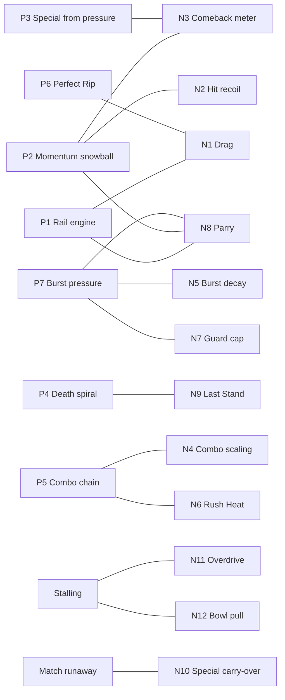

# 03 · Feedback loops

> **Negative feedback** creates stability: it pulls the game back toward an equilibrium. **Positive feedback** amplifies differences and creates an "arms race" (Adams & Dormans, Ch. 4 and Ch. 6).
>
> Positive does not mean good, and negative does not mean bad. *"Positive destructive feedback does exist"*: losing pieces in chess makes you likelier to lose more.

Each loop below is profiled with the **seven feedback characteristics** from Adams & Dormans' Table 6.1, plus **determinability** from Table 6.2:

| Characteristic | Question it answers |
|---|---|
| **Type** | Does it amplify (+) or dampen (−)? |
| **Effect** | Does it push toward winning (constructive) or toward losing (destructive)? |
| **Investment** | What must the Blader put in to start it? |
| **Return** | What does it pay back? |
| **Speed** | How quickly does it go round once? |
| **Range** | How many nodes does it pass through (short / medium / long)? |
| **Durability** | How long does it keep working: temporary, limited, extended or permanent? |
| **Determinability** | Is it deterministic [det], random [rnd], skill-based [skill], dependent on the other Blader [mp], or strategic [strat]? |

Paths use the node names from [02-machinations.md](02-machinations.md).

---

## Positive feedback loops (amplifiers)

### P1 · Rail engine: *speed buys the rail, the rail buys speed*
**Path:** Velocity → (≥ Gear 1) Xtreme Line latch → +320/s → Velocity
| Type | Effect | Investment | Return | Speed | Range | Durability | Determinability |
|---|---|---|---|---|---|---|---|
| + | Constructive | Low: reach Gear 1 and commit to the edge path | High: Gear 3 in about 2.5 s | Fast | Short (2 nodes) | Permanent, but broken by any Clash, Guard or steering off the rail | [skill] |

**Serves:** Sensation (the speed-up), Challenge (lines and timing).
**Built-in risk:** the rail runs next to the Over Zones. Gearing up exposes you to an Over Finish, so the engine is also a gamble.
**Checked by:** N1 Drag caps it; N8 Parry punishes cashing it in predictably.

### P2 · Momentum snowball: *hits make the next hit easier*
**Path:** Velocity A → Hit → Spin B ↓ → Wobble B (weaker steering, less knockback resistance) → B can't escape → Hit
| Type | Effect | Investment | Return | Speed | Range | Durability | Determinability |
|---|---|---|---|---|---|---|---|
| + | Constructive for A, destructive for B | Medium: the Velocity spent on each hit | Medium | Medium (one exchange, 2–4 s) | Medium (4 nodes) | Extended (the whole Round) | [skill] [mp] |

**Serves:** Competition. Pressure should *feel* like it's working.
**Checked by:** N2 hit recoil, N3 comeback meter, N4 combo scaling, N9 Last Stand.

### P3 · Special from pressure: *aggression charges your ability*
**Path:** Hits dealt → Special A (+8 each) → Special Move → more Hits → Special A
| Type | Effect | Investment | Return | Speed | Range | Durability | Determinability |
|---|---|---|---|---|---|---|---|
| + | Constructive | High: about 10 or more hits | High: a guaranteed big moment | Slow (15–20 s) | Long | Extended: carries over between Rounds | [skill] [strat] |

**Serves:** Fantasy, the Special Move payoff.
**Checked by:** N3. The defender earns Special **faster** (+12 per hit taken), so pressure charges your rival's Special Move too.

### P4 · Death spiral: *low Spin makes you lose Spin faster*
**Path:** Spin ↓ → Wobble → steering × and knockback resistance ↓ → more hits taken and more Over Zone risk → Spin ↓
| Type | Effect | Investment | Return | Speed | Range | Durability | Determinability |
|---|---|---|---|---|---|---|---|
| + | **Destructive** | None (automatic) | Speeds up the end of the Round | Fast near the end | Medium | Extended | [det] [mp] |

**Serves:** Tension, because the end of a Round should feel dangerous. Left unchecked, it makes the result feel decided before the Finish.
**Checked by:** **N9 Last Stand**, whose sole purpose is this loop. N3 also helps.

### P5 · Combo chain: *hit, bounce, hit again*
**Path:** Hit → knockback toward the wall → wall bounce returns B → Rush → Hit (the Combo count rises)
| Type | Effect | Investment | Return | Speed | Range | Durability | Determinability |
|---|---|---|---|---|---|---|---|
| + | Constructive | Low: well-timed Rushes | Low to medium (damage scales down) | Very fast (≤ 1.2 s) | Short | **Temporary**: resets 1.2 s after the last hit | [skill] |

**Serves:** Sensation. "3 HIT!", "5 HIT!" pop up while the damage quietly shrinks.
**Checked by:** N4 combo scaling and hit i-frames; N6 Rush Heat.

### P6 · Perfect Rip head start
**Path:** Rip [skill] → Spin 100 + Gear 2 start → first to the rail → first hit → P2
| Type | Effect | Investment | Return | Speed | Range | Durability | Determinability |
|---|---|---|---|---|---|---|---|
| + | Constructive | Low: one timed gesture | Small | Instant | Short | **Limited**: once per Round, gone within about 5 s | [skill] |

**Serves:** Challenge. It's a skill test in the first second, and it gets everyone's attention right away.
**Checked by:** N1 Drag erases the extra speed within seconds; N2 and N3 soften an early first hit.

### P7 · Burst pressure / turtle trap
**Path:** Gear 3 hits → Burst B rises faster than it decays → B Guards → Guard drains Velocity B → B is too slow to escape or gear up → more hits → Burst B
| Type | Effect | Investment | Return | Speed | Range | Durability | Determinability |
|---|---|---|---|---|---|---|---|
| + | Destructive for B | High: repeated Gear 3 hits | Very high: a Burst Finish is worth 2 points | Fast | Medium | Temporary: breaks once hits stop for 1.5 s | [skill] [mp] |

**Serves:** Sensation and Competition. A Burst is the loudest Finish.
**Checked by:** N5 Burst decay; N7 Guard cap; **N8 Parry**, because a guarding Bey is already set up to Parry.

> **An amplifier that is not a loop: Clash Lock.** The mash winner receives **both** Beys' Velocity, which magnifies a small skill edge into one huge hit. It doesn't feed itself, because the recoil (N2) resets it. So it creates *spikes*, not snowballs, which is exactly the anime beat we want.

---

## Negative feedback loops (stabilisers)

### N1 · Drag: *the faster you go, the more you lose*
**Path:** Velocity → Drag (0.6 × v per s) → Velocity ↓
| Type | Effect | Investment | Return | Speed | Range | Durability | Determinability |
|---|---|---|---|---|---|---|---|
| − | Destructive (on Velocity) | None | — | Continuous | Short (1 node) | Permanent | [det] |

**Pattern:** Dynamic Friction. **Purpose:** an equilibrium top speed on the rail, so Gear 3 is a *state you hold*, not an infinite climb. **Checks:** P1, P6.

### N2 · Hit recoil: *every hit resets to neutral*
**Path:** Hit → attacker keeps 35% of its Velocity; knockback pushes B away → distance ↑ → back to NEUTRAL
| Type | Effect | Investment | Return | Speed | Range | Durability | Determinability |
|---|---|---|---|---|---|---|---|
| − | Stabilising | The hit itself | Distance and a reset | Instant | Short | Permanent | [det] |

**Purpose:** the **rhythm** of exchanges. No hit leads straight into another hit without a new decision. **Checks:** P2, P5.

### N3 · Comeback meter: *taking hits charges you more than dealing them*
**Path:** Hits taken → Special B (+12, against +8 for A) → B's Special Move comes first → hits A
| Type | Effect | Investment | Return | Speed | Range | Durability | Determinability |
|---|---|---|---|---|---|---|---|
| − | Constructive for the trailing Blader | None | High | Slow | Long | Extended (carries over, see N10) | [mp] |

**Purpose:** keep the trailing Blader in the fight. **Checks:** P2, P3.
**Warning, from Adams & Dormans' "negative feedback basketball":** negative feedback *stabilises the difference* between players; it does not let the weaker side overtake. That is what we want: close games that skill still decides. If the trailing Blader starts winning more than half the time, N3 is too strong.

### N4 · Combo scaling and hit i-frames
**Path:** Combo count ↑ → damage × 100 / 80 / 65 / 50%; plus 0.25 s invulnerability after each hit taken
| Type | Effect | Investment | Return | Speed | Range | Durability | Determinability |
|---|---|---|---|---|---|---|---|
| − | Stabilising | None | — | Very fast | Short | Temporary (per combo) | [det] |

**Pattern:** Stopping Mechanism. **Purpose:** long combos *look* bigger but *pay* less, so no one is juggled to death. **Checks:** P5.

### N5 · Burst decay
**Path:** Burst Gauge → drains 8/s once 1.5 s pass without a hit
| Type | Effect | Investment | Return | Speed | Range | Durability | Determinability |
|---|---|---|---|---|---|---|---|
| − | Constructive for the defender | Surviving 1.5 s | Burst clears | Medium | Short | Permanent | [det] [mp] |

**Pattern:** Dynamic Friction on a destructive pool. **Purpose:** a Burst needs **sustained** Gear 3 pressure, not scattered pokes. **Checks:** P7.

### N6 · Rush Heat
**Path:** Rush → Heat +4 → next Rush costs 6 + Heat Spin → fewer Rushes. Heat clears 2 s after the last Rush.
| Type | Effect | Investment | Return | Speed | Range | Durability | Determinability |
|---|---|---|---|---|---|---|---|
| − | Destructive (on Spin) for spammers | Spin | — | Fast | Short | Temporary (2 s) | [strat] |

**Pattern:** Stopping Mechanism, the law of diminishing returns. **Purpose:** Rush is *never locked* (always something to press), but mashing it burns your own life. **Checks:** Rush spam, P5.

### N7 · Guard cap
**Path:** Guard held → 1.5 s timer → forced release → 1 s cooldown. Guarding also drains your own Velocity.
| Type | Effect | Investment | Return | Speed | Range | Durability | Determinability |
|---|---|---|---|---|---|---|---|
| − | Stabilising | Your own Velocity | Damage reduction | Fast | Short | Temporary | [strat] |

**Purpose:** Guard is a *reaction*, not a place to live. **Checks:** turtling (the anti-dynamic in [01 §3.6](01-mda.md)).

### N8 · Parry: *the more you commit, the more you can lose*
**Path:** Attacker Velocity (higher Gear means more at stake) → Parry trader → 80% goes to the defender, and the attacker is stunned for 0.4 s → the defender strikes back at high Gear
| Type | Effect | Investment | Return | Speed | Range | Durability | Determinability |
|---|---|---|---|---|---|---|---|
| − | Destructive for predictable aggression | Timing risk: a whiffed Parry is just a Guard, with its cooldown | High, and it grows with the attacker's Gear | Instant | Short | Permanent | [skill] [mp] |

**Pattern:** Attrition, reversed. **Purpose:** the counter-read that turns Rush / Guard / Parry into a triangle. Aggression stays good, but *predictable* aggression doesn't. **Checks:** P1 and P2 when played on autopilot, and Rush spam.

### N9 · Last Stand: *the anime comeback*
**Path:** Spin < 25% → trigger (once per Round) → Burst cleared, +50 Special, Velocity gain × 1.3 for 5 s
| Type | Effect | Investment | Return | Speed | Range | Durability | Determinability |
|---|---|---|---|---|---|---|---|
| − | Constructive for the trailing Blader | None (happens on its own) | High, briefly | Instant | Short | **Limited** (once per Round) | [det] |

**Pattern:** Stopping Mechanism on a destructive positive loop. **Purpose:** break the death spiral and create a dramatic *moment*, not a guaranteed win. **Checks:** P4, P7.

### N10 · Special carry-over (Match level)
**Path:** Round lost → usually more hits were taken → more Special carried into the next Round → earlier Special Move
| Type | Effect | Investment | Return | Speed | Range | Durability | Determinability |
|---|---|---|---|---|---|---|---|
| − | Constructive for the Round loser | None | Medium | Slow (one Round) | Long | Permanent | [mp] |

**Purpose:** a gentle comeback across the Match that never gives anyone points. **Checks:** a Match-level runaway leader.

### N11 · Overdrive: *escalation against stalling*
**Path:** Round time ≥ 30 s → Spin Decay × 2.5 and Over Zones × 1.5 wider → any contact is more likely to end the Round
| Type | Effect | Investment | Return | Speed | Range | Durability | Determinability |
|---|---|---|---|---|---|---|---|
| Escalation (pressure toward the end condition) | Destructive for both | None | — | Slow to switch on, fast once active | Medium | Rest of the Round | [det] |

**Pattern:** Escalating Challenge, driven by time. It isn't strictly a loop on player state; it's **pressure on the end conditions** so a Round never stalls. **Checks:** stalemate and waiting.

### N12 · Bowl pull: *distance brings you back*
**Path:** distance from the Stadium centre → inward bowl force → Beys drift back toward each other
| Type | Effect | Investment | Return | Speed | Range | Durability | Determinability |
|---|---|---|---|---|---|---|---|
| − | Stabilising (on position) | None | Re-engagement | Continuous | Short | Permanent | [det] |

**Purpose:** you can't run away forever; the Stadium itself brings the fight back together. It already exists in the prototype (`bowlForce`). **Checks:** stalemate, kiting.

---

## Which loop checks which

Every amplifier has at least one damper, and every damper answers a named amplifier or anti-dynamic. A damper that checks nothing is dead weight; an amplifier with no damper is a runaway.

---

## Loop health

Adams & Dormans: *"games with multiple feedback loops exhibit more emergence"*, and a loop's strength comes from how its characteristics **combine**, not from any single one. How the loops balance at each time scale:

| Time scale | Amplifiers | Dampers | Intended feel |
|---|---|---|---|
| Moment (≤ 1 s) | P5 combo, Clash Lock spikes | N4 scaling, i-frames | Loud and punchy, but not decisive |
| Exchange (2–4 s) | P1 rail, P2 snowball, P6 Rip | N1 drag, N2 recoil, N8 Parry | A rhythm of neutral, strike, reset. Whoever reads better wins the exchange. |
| Round (15–45 s) | P3 Special, P4 death spiral, P7 Burst pressure | N3 comeback, N5 decay, N9 Last Stand, N11 Overdrive, N12 bowl | Rising tension, one comeback moment, a guaranteed Finish |
| Match (1–3 min) | Points (a straight race) | N10 carry-over | Close, with no Blader out of it before the last Round |

### Failure modes to watch
In the spirit of MDA's Monopoly analysis. Every signal can be measured with the headless balance harness (`npm run balance`).

| Failure mode | Signal | Knob to turn |
|---|---|---|
| **Runaway leader** | The Blader who lands the first hit wins more than 75% of Rounds | Strengthen N3 (hits-taken Special), N9 (Last Stand threshold), N2 (recoil) |
| **Comeback too strong** | The Blader behind at the Round's midpoint wins more than 50% | Weaken N3 or N9; see the negative-feedback-basketball warning above |
| **Stalemate** | Median Round over 45 s, or a Clash less often than every 4 s | Bring Overdrive (N11) earlier, strengthen the bowl (N12), move the rail inward |
| **Turtling** | Guard held more than 30% of the time | Shorten the Guard cap (N7); make Guard drain Velocity harder |
| **Rush spam wins** | An "always Rush" CPU beats a mixed CPU more than 60% of the time | Raise Rush Heat (N6); widen the Parry window (N8) |
| **Spin Finish dominates again** | Spin Finishes above 30% | Lower Spin Decay; raise Clash damage; widen the Over Zones |
| **Special Move never happens** | Fewer than 1 Special Move per Round on average | Raise Special gains; lower the gauge cap |
