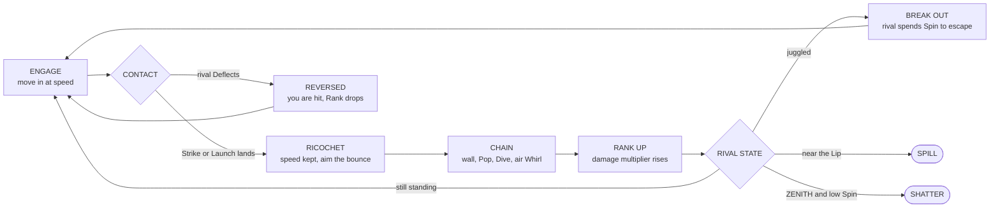
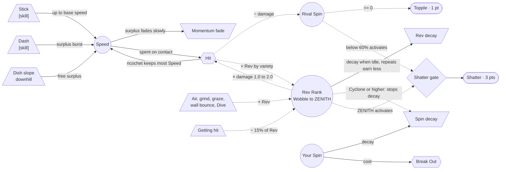
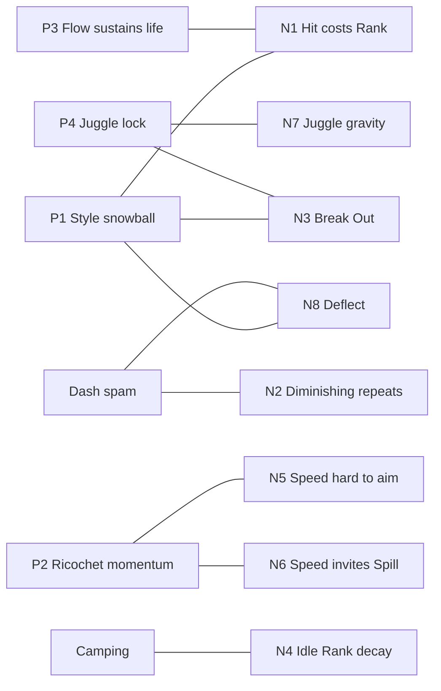

> **Update (2026-09-24):** the moment-to-moment loop is now the counter triangle in **[moveset-triangle.md](moveset-triangle.md)**, which has 3 loops, down from the 12 below. This file is kept for history. The numbers were corrected to match the data: getting hit costs 15% of Rev (not −2 Ranks), and the Shatter gate is a rival below 60% Spin (not 30%).

# Core loop and feedback loops

This uses the same frameworks as [../../gameplay/](../../gameplay/README.md):
- **MDA** (Hunicke, LeBlanc & Zubek) for the aesthetics
- **Machinations** (Adams & Dormans) for the economy and feedback profiles

The legend for the diagrams:
- `(( ))` pool
- `[/ \]` source
- `[\ /]` drain
- `{{ }}` converter
- `{ }` gate
- `([ ])` end condition
- a solid arrow is a resource flow; a dotted arrow is a state connection

---

## 1. MDA

| Rank | Aesthetic | In SPINRIOT |
|---|---|---|
| 1 | **Sensation** | Speed, ricochets, hit-stop, heating trails, the Shatter cut-in |
| 2 | **Challenge** | Execution: cancels, aimed ricochets, juggles, Deflect reads |
| 3 | **Competition** | Beating the rival, and beating them *stylishly* |
| 4 | **Fantasy** | A top that fights, dressed in street-riot style |
| 5 | **Expression** | Your own chains and lines; the Rank rewards variety |

**Target dynamics:** chain-and-flow aggression, momentum swings (Rank lost when you're hit), comeback windows (Break Out, Deflect), and a climax where every Round is building toward a Shatter.

---

## 2. The core loop (1–3 s, repeating)

Every contact is a read. Strike, Launch or bait a Deflect? And every successful hit **flows into the next move** instead of ending in a stop.

---

## 3. Machinations sketch: Speed, Rev Rank and Spin

**How to read it**
- **Speed is the fuel of each hit.** Stick, Dash and slope are the sources, and the fade is the drain. The **Hit** converter turns Speed into rival Spin loss, then pays most of that Speed back through the ricochet. That payback is what keeps you flowing.
- **Rev Rank is the multiplier.** It sits between your skill and your damage. It rises with variety and tricks, and falls when you idle, repeat moves or get hit.
- **Spin is life.** At high Rank its decay drain switches off, so flow sustains you.
- **The Shatter gate needs two conditions:** your Rank at ZENITH *and* the rival below 60% Spin.

---

## 4. Feedback loops

Each loop is profiled with Adams & Dormans' characteristics:
- **Type:** positive (+) or negative (−)
- **Effect:** constructive or destructive
- **Investment**, **Return**, **Speed**, **Range** and **Durability**
- **Determinability:** [det] deterministic · [skill] · [mp] multiplayer · [strat] strategic

### Positive loops (amplifiers)

| Id | Loop | Path | Type · Effect | Investment → Return | Speed · Range · Durability | Determinability | Checked by |
|---|---|---|---|---|---|---|---|
| **P1** | **Style snowball** | Rank → damage × → rival stunned or launched → more hits → Rank | + · constructive | Execution → big damage | Fast · medium · lasts until you're hit | [skill] | N1, N3, N4 |
| **P2** | **Ricochet momentum** | Hit → Speed kept → faster next hit → more Rank | + · constructive | One hit → a free approach | Very fast · short · per chain | [skill] | N5, N6 |
| **P3** | **Flow sustains life** | High Rank → no Spin decay → you outlast them → more time to style | + · constructive | Staying at Cyclone+ → survival | Slow · long · extended | [skill] | N1 |
| **P4** | **Juggle lock** | Launch → the rival is airborne and can't act → air hits → re-Launch | + · destructive for the rival | Precise timing → many hits | Very fast · short · temporary | [skill] [mp] | N3, N7 |

### Negative loops (stabilisers)

| Id | Loop | Path | Type · Effect | Speed · Durability | Determinability | Checks |
|---|---|---|---|---|---|---|
| **N1** | **Hit costs Rank** | Getting hit → −15% of Rev → less damage and Spin decay resumes | − · destructive for the leader | Instant · permanent | [mp] | P1, P3 |
| **N2** | **Diminishing repeats** | The same move again → smaller Rev gain | − | Fast · rolling window | [strat] | Mashing, Dash-spam |
| **N3** | **Break Out** | Juggled → spend Spin → escape with brief invulnerability | − · constructive for the defender | Instant · per juggle | [skill] | P4, P1 |
| **N4** | **Rank decays when idle** | No fresh action → Rank falls | − | Slow · permanent | [det] | Camping |
| **N5** | **Surplus Speed is hard to aim** | More Speed → wider ricochet angles and turns | − | Continuous · permanent | [skill] | P2 |
| **N6** | **Speed invites a Spill** | High Speed near the Lip → risk of flying out; the bowl pulls you back to the centre | − | Continuous · permanent | [det] [skill] | P2 |
| **N7** | **Juggle gravity** | Each successive air hit launches less high | − | Fast · per juggle | [det] | P4 (infinite juggles) |
| **N8** | **Deflect** | Predictable Strikes get reversed, costing the attacker Rank | − · destructive for autopilot aggression | Instant · permanent | [skill] [mp] | P1 on autopilot, Dash-spam |

### Which loop checks which

---

## 5. Failure modes to watch

| Failure mode | Signal (headless harness) | Knob to turn |
|---|---|---|
| **Infinite juggles** | Juggles of more than 6 hits, or the defender never Breaks Out | Stronger juggle gravity (N7); cheaper Break Out (N3) |
| **ZENITH snowball** | Whoever reaches ZENITH first wins more than 80% of Rounds | Bigger Rank loss on hit (N1); a Rank decay floor |
| **Topple camping** | Topples above 35% of finishes | Faster Spin decay at low Rank; stronger idle Rank decay (N4) |
| **Dash spam** | Dash is more than 50% of all moves | Harsher diminishing repeats (N2); a wider Deflect window (N8) |
| **Flow too hard** | A new player's median Rank is below Spinning | More generous Rev gains; longer idle grace before decay |
| **Shatter too rare** | Fewer than 1 Shatter per Match | Lower the ZENITH threshold; raise the rival-Spin gate to 40% |
