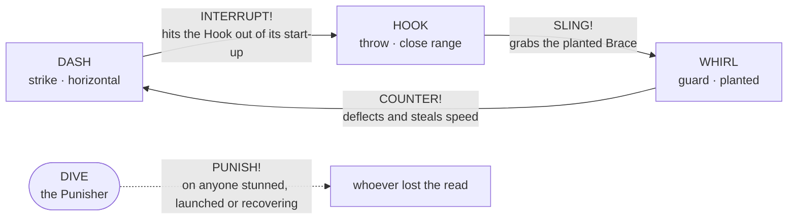
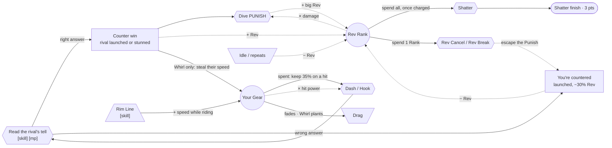

# Moveset triangle: why you press every button

> **Status: current design (2026-09-24).** This replaces the old "three buttons, everything cancels" moveset in [README.md](README.md#controls-a-stick-and-3-buttons-everything-cancelable).
>
> Why it changed: [../../audit/book-compliance.md](../../audit/book-compliance.md). In short, no action cost anything, so no action was a decision.
>
> **Implementation status** (checked against `data/game` and `src/game`, 2026-09-24):
> - ✅ implemented
> - ◐ partial (the gap is noted)
> - ☐ not implemented
>
> Tally: every rule in this doc is implemented except the **6 partials** listed in [§11](#11-implementation-checklist-whats-left).

**The rule of the fight:** every attack has a counter, every move you commit to can be punished, and **every attack spends the speed you built**.

- **Build** speed (Gear) on the Rim Line.
- **Read** what your rival is about to do.
- **Answer** it with the move that beats it, spending your Gear.
- **Cash in** the opening with a Dive.

Style (the Rev Rank) is earned by reading well, and spent on the Shatter.

---

## 1. The triangle: DASH › HOOK › WHIRL › DASH

This is the fighting-game triangle of **strike beats throw, throw beats guard, guard beats strike**. It gives every option a counter (intransitive options, GM 19120), and each option has a job of its own rather than being a stronger copy of another (orthogonal differentiation, GM 8935).

| Move | Key | Role | Feel | Its one job | **Beats** | **Loses to** | Tell (seen before it lands) |
|---|---|---|---|---|---|---|---|
| ✅ **DASH** | J | Strike | **Horizontal.** A short rev-up, then a straight burst along the stick | Hit first. It interrupts anything slow. | **HOOK**: a Hook is slow to grab, so the Dash hits it out of its start-up | **WHIRL** | A rev-up flash and an arrow for 0.12 s; a speed trail |
| ✅ **WHIRL** | L | Guard | **Planted.** You stop dead and spin up a blade ring | Block. The ring **Deflects** any hit: the attacker is launched, and you **take its speed** and ricochet off with it. | **DASH** (and a Dive into the ring) | **HOOK**: the ring can't stop a grab | The ring is drawn for the whole Brace, and the Rig stands still |
| ✅ **HOOK** ★ | I | Throw | **Close range.** Reach out, latch onto the rival's rim and **sling them where you aim** | Move the rival: into the Rim (a Wall Splat), toward a Lip gap (a Spill), or out of their Brace | **WHIRL**: a planted, braced Rig is an easy grab | **DASH**: its start-up is slow and its reach short | A reach arc in front of the Rig during start-up; a tether line on the grab |

**Mirror matches:**
- ✅ **Dash vs Dash:** a **Clash**. Both bounce apart and nobody takes damage.
- ✅ **Whirl vs Whirl:** nothing happens. Both are planted, and the idle Rev drain punishes both.
- ✅ **Hook vs Hook:** both grabs slip, and the Rigs are pushed apart.

**Against a Rig that's only steering (not using a move):**
- ✅ **Dash** Strikes it, a small hit.
- ✅ **Hook** Slings it.
- ✅ **Whirl** does nothing. It's purely a guard.

---

## 2. DIVE: the Punisher, outside the triangle

| | |
|---|---|
| ✅ **Input** | **K** to Pop (a hop), then **K** again to Dive (crash straight down). A landing marker shows where you'll hit. |
| ◐ **Its one job** | **Cash in a read you've won.** A Dive onto a Rig that is **stunned, launched, or recovering from a move** is a **PUNISH**: big damage, a long stun and the biggest Rev gain. *Gap: the Punish stun is the same 0.45 s as every stun, not a longer one.* |
| ✅ **On a free Rig** | It's a plain **Slam**: small damage and a short stun. The marker gives them time to step away, so it's a poor opener. |
| ✅ **Its risk** | While you're hopping, a grounded Dash knocks you **OUT OF THE AIR**. A Dive into an active Whirl is Deflected. |

This is what makes the combos make sense: **win the triangle, then Dive to cash it in.**
- ✅ **Whirl** Deflects a Dash → the rammer is launched → **Dive PUNISH**
- ✅ **Hook** slings them into the Rim → Wall Splat, and they're launched → **Dive PUNISH**
- ✅ **Dash** Interrupts a Hook → the Hooker is launched → **Dive PUNISH**

---

## 3. The air game: the same triangle, in the air

Pop and Dive stay, and **all the air moves stay**. In the air, the triangle buttons do their air versions, and the **same rules** apply:

| Air move | Role | Beats | Loses to | Special |
|---|---|---|---|---|
| ✅ **Air Dash** | Strike | Air Hook | Air Whirl | An **Air Strike** on a launched rival keeps the juggle going (each relaunch is lower) |
| ✅ **Air Whirl** | Guard | Air Dash | Air Hook | A Deflect in mid-air launches the attacker |
| ✅ **Air Hook** ★ | Throw | Air Whirl | Air Dash | **Spike**: grabs an airborne rival and hurls them into the ground (a stun) |

**How the air game fits in:**
- ✅ **Launches come from winning a read.** The Whirl no longer launches on contact. Instead, every triangle win launches the loser: COUNTER, INTERRUPT, and a SLING that ends in a Wall Splat.
- ◐ **A full combo:** win the read → juggle with Air Dash → finish with a **Spike** or a **Dive PUNISH**. *Gap: every piece works, but in CPU play juggles top out at 2 hits, so the long air combo is possible but not yet seen.*
- ✅ **Break Out is kept.** A launched Rig can spend Spin to burst free, which is how the juggled Rig fights back.
- ◐ **Out of the Air:** a grounded Dash that hits a hopping or diving Rig knocks it sideways toward the Rim. Being in the air has a risk. *Gap: the knockback goes along the line of the hit, not specifically toward the Rim.*

---

## 4. Why the player presses anything: the read table

| The rival is… | You see… | Answer with | Then |
|---|---|---|---|
| ✅ about to Dash | a rev-up flash and arrow | **WHIRL** | Dive the launched rammer |
| ✅ Bracing | a blade ring, standing still | **HOOK** | Dive after the Wall Splat |
| ✅ reaching to Hook | a reach arc | **DASH** | Dive the launched Hooker |
| ◐ hopping | a shadow and a landing marker *(the marker only shows once it Dives)* | **DASH** (Out of the Air) | Chase it with a Dive |
| ✅ stunned, launched or recovering | a dizzy spin, or recovery sparks | **DIVE** | — |
| ✅ just steering | plain movement | **DASH** or **HOOK**, or bait with a Whirl | — |
| ✅ flaming on the Rim Line (Gear 3) | 3 pips, a flame ring, a hot trail | **WHIRL** when it comes off the Rim: steal its Gear | Dive the launched rammer |
| ✅ at Gear 0 (just spent a hit, or planted) | no pips, a grey trail | Go in: its Dash is a weak poke | — |

**It has to be a read, not a reflex:**
- ✅ The Dash rev-up is shorter than human reaction time, so you Whirl because you *expect* a Dash.
- ✅ **Every move commits you:** you get a recovery window before you can act again, and the recovery is visible, so it can be punished.
- ✅ **Landing a hit cancels your recovery.** Winning the exchange frees you to follow up.
- ✅ **Losing means you're launched or stunned**, which is exactly what a Dive punishes.

Guessing wrong is the cost, and that's what satisfies "attacking must cost something" (GM 18733).

---

## 5. Gears: speed is what every attack spends

**Why.** The audit's first rule: *attacking must cost a resource that could be spent elsewhere* (GM 18733). The triangle made attacks cost **commitment**; Gears make them cost **speed**. Speed is the one thing a spinning top visibly has, and everyone reads it right: faster hits harder (the gameplay docs' "Velocity is the currency", [01 §4.1](../../gameplay/01-mda.md#41-resources)).

### Gears are speed in four readable steps
| Gear | Speed (× your base speed) | On the Rig | Hit power (damage · knockback) |
|---|---|---|---|
| ✅ **0** | under 0.6 | no pips, grey trail | ×0.5 · ×0.6 |
| ✅ **1** | 0.6 or more (cruising on the stick) | 1 pip, trail in your colour | ×1 · ×1 |
| ✅ **2** | 1.5 or more | 2 pips, gold trail | ×1.6 · ×1.3 |
| ✅ **3** | 2.2 or more | 3 pips, a flame ring, a hot pink trail, and a **GEAR 3!** shout | ×2.4 · ×1.6 |

Hit power is read off this table, with no hidden formula (the audit's rule 2). Your Rev Rank still multiplies on top.

### Earning Gear (sources)
- ✅ **Stick:** up to your base speed, which is Gear 1.
- ◐ **The Rim Line** ★ is a glowing band around the outer ring of the bowl, which brightens while someone rides it. Ride it at Gear 1 or more and it keeps accelerating you, from Gear 1 to Gear 3 in about 1.5 s. It runs right past the Lip gaps and the wall, which is where Slings and Wall Splats happen. **Building Gear is visible and risky.** *Gap: the band was moved inward (0.56–0.80 of the radius) after it pushed Spills to 85%, so it no longer runs right past the gaps and is less risky than written. Reaching Gear 3 is tested; the 1.5 s timing isn't measured.*
- ✅ **Downhill:** the bowl slope, as before.
- ✅ **Steal:** a Whirl that COUNTERs a Dash takes 85% of the rammer's speed (a trader).

### Spending Gear (drains and converters)
- ✅ **Dash** adds a fixed boost to the speed you already have.
  - From Gear 1 it hits at Gear 2.
  - Off the Rim Line at Gear 3 it's a flaming hit that can Spill.
  - From a standstill it's a weak poke.
- ✅ **Landing a Dash spends it.** You keep only 35% of your speed (it used to be 92%). One big hit, then build again.
- ✅ **Hook** throws harder the faster you were moving, because your Gear sets the Sling. The grab stops you dead.
- ✅ **Whirl** plants you, so it throws your own Gear away. Guarding costs your momentum, and a COUNTER refills it with theirs.
- ✅ **Drag:** speed above your base fades unless something feeds it.

### The decisions this creates
- **Build or strike now?** A Gear 1 Dash is quick but weak. A Gear 3 Dash can win the Round, but you had to circle the Rim where the rival saw it coming.
- **Guard or keep?** A Whirl dumps your Gear 3, unless they Dash into it, in which case you take theirs.
- **High Gear is a tell.** A flaming rival on the Rim Line is about to cash in. Wait for it with a Whirl.
- **A spent rival is an opening.** Right after landing a hit, the attacker is at Gear 0–1, so go in.

---

## 6. Style: Rev is earned by reads and spent to survive or to kill

**Gains:**

| Event | Callout | Rev |
|---|---|---|
| ✅ Whirl beats Dash | **COUNTER!** | big |
| ✅ Hook beats Whirl | **SLING!** | big |
| ✅ Dash beats Hook | **INTERRUPT!** | big |
| ✅ Grounded Dash on a hopping Rig | **OUT OF THE AIR!** | big |
| ✅ Air Hook on an airborne Rig | **SPIKE!** | big |
| ✅ Dive on a stunned, launched or recovering Rig | **PUNISH!** | biggest |
| ✅ A slung Rig hits the Rim | **WALL SPLAT** | medium |
| ✅ Air Strike (juggle) | SKY STRIKE | medium |
| ✅ A plain Strike or Slam on a free Rig | STRIKE / SLAM | small |

**Losses:**

| Event | Callout | Rev |
|---|---|---|
| ✅ Being hit | **−REV** | −15% of Rev |
| ✅ Losing an exchange (a counter, punish, spike or out-of-the-air lands on you) | **COUNTERED** | −30% of Rev |
| ✅ Repeating the same win (variety window) | **STALE** | less gained |
| ✅ Idling longer than the grace period | — | drain |

### Spending Rev: the Rank is the resource
Rev is spent **one Rank at a time**, and your Rank is also your damage multiplier. So every spend is the same question: *hold the Rank for damage, or spend it to survive or to kill?* That's the book's rule that a resource needs several spends with a real trade-off (GM 17750; the Prince of Persia sand example, GM 4520).

| Spend | Input | Cost | Why you'd do it |
|---|---|---|---|
| ✅ **REV CANCEL** ★ | The **Rev chord, Dash + Whirl (J+L)**, while you're **recovering or stunned** (after a whiff, or after losing a read) | 1 Rank | Drop straight back to neutral, free to act: escape before the Dive PUNISH lands, or get your answer in first |
| ✅ **REV BREAK** ★ | Any button while **launched**, at Steady or higher | 1 Rank (no Spin) | Escape a juggle without bleeding life. At Wobble, Break Out still costs Spin. |
| ✅ **SHATTER** | The same chord at ZENITH, **once charged** (below), with the rival below 65% Spin | All your Rev | The 3-point finish. A whiff costs 2 Ranks. |

**One chord, read by context.** Dash + Whirl is the Rev input:
- ✅ charged at ZENITH, it Shatters
- ✅ recovering or stunned with a Rank, it Rev Cancels

✅ A **single** button during recovery never spends Rev. It's refused, with the red flash, so mashing can't burn your Ranks. The first build spent a Rank on any press during recovery. The report card showed the CPU burning about 6 Ranks a round without meaning to, and a mashing player would have done the same.

✅ The HUD shows your Rank as **pips you can spend**. While you're recovering or stunned with a Rank to spare, your Rig shows a cyan ring and **REV CANCEL · J+L** (seen in the browser). ◐ On touch, the chord button reads **REV** then, and **SHATTER** when the Shatter is ready. *Coded, but the REV label hasn't been seen on a phone yet.*

### The Shatter: charged, fragile and dodgeable
The first measurements showed a snowball: whoever reached ZENITH first won 85–100% of Rounds. The Shatter had no answer. Each rule below gives the rival one:

| Rule | What it does | The rival's answer |
|---|---|---|
| ✅ **Charge** | ZENITH must be held **1.4 s** before the Shatter is ready. A pink arc fills around the Rig and pulses once charged. | See it coming; go in during the charge |
| ✅ **ZENITH is fragile** | Any hit taken at ZENITH also drops at least **1 Rank**, which resets the charge | Land anything on a charging Rig |
| ✅ **Jump dodges it** | The Shatter homes and ignores height against a Rig that's launched, stunned or Breaking Out. A voluntary **Jump** clears it, and a whiff costs 2 Ranks. | The SHATTER slow-mo is the tell: Jump |

✅ The Shatter now **homes** (it keeps turning toward the rival while it lasts) instead of aiming once at the start. Before that change, 67% of Shatters whiffed.

### What each Rank multiplies
The curve is flattened so a lead can't run away:

| Rank | Wobble | Steady | Spinning | Blurred | Cyclone | Vortex | ZENITH |
|---|---|---|---|---|---|---|---|
| ✅ Damage | ×1.0 | ×1.1 | ×1.2 | ×1.35 | ×1.5 | ×1.7 | ×2.0 |

✅ Cyclone and above still stop your Spin decaying.

### Redline ★: the comeback
Below **35% Spin** you're in **Redline**:
- ✅ Your Rev gains are **×1.4**.
- ✅ Your Rank can't fall below **Steady** from hits, idling or whiffs, so you always have a Rank to spend on a Rev Cancel or a Rev Break. Spending is your choice, so it isn't floored.
- ✅ It shows as a red Spin bar labelled **REDLINE** and a **REDLINE** callout.

This is the gameplay docs' comeback loop (N3, negative-constructive). Per the book's "negative-feedback basketball" warning, it's tuned to keep the trailing Rig *in* the fight, not to hand it the lead. The report card checks both directions:
- ✅ A Rig that dipped below 40% Spin should win ≥ 25% of Rounds (measured: 48%).
- ✅ The Rig behind at the midpoint should win ≤ 50% (measured: 40%).

---

## 7. The three loops

Keeping to 2–4 major loops makes the game one players can learn (GM 7704–7714). Each loop runs through a button press.

| Loop | Path | Type · effect | Investment → return | Speed · range · durability | Determinability | Checked by |
|---|---|---|---|---|---|---|
| ✅ **L1 · Read → counter → punish** | tell → the right answer → rival launched or stunned → Dive PUNISH → Rev | + · constructive | a committed guess → a free combo | Fast (1–2 s) · short · per exchange | [skill] [mp] | Wrong guesses are punished; Break Out; the rival's own reads |
| ◐ **L2 · Gear: build → spend → steal** | Rim Line → Gear → a big Dash or Sling → speed spent; a Whirl steals a rammer's Gear | + (Rim Line engine) with − (spending, drag, steal) | time on the Rim, which is visible and risky → a Gear 3 hit | Medium (1.5–3 s) · short · until you hit or plant | [skill] [mp] | Spending on every hit; the steal; Lip gaps and Wall Splats next to the Rim Line. *Gap: the Rim Line was moved inward, so the risk of building Gear there is weaker than designed.* |
| ✅ **L3 · Style → spend** | reads → Rev Rank → ×damage (max ×2); spend a Rank to escape (Rev Cancel, Rev Break) or all of it to kill (charged Shatter) | + · constructive, slow, with a spend-to-use damper | many reads → survival or a 3-point finish | Slow (10–20 s) · long · lasts until spent or countered | [skill] [strat] | Countered costs −30%; idle drain; ZENITH is fragile and must charge; every spend lowers your multiplier; Redline lifts the trailing Rig |

---

## 8. The cue table: every move gets a sign before and feedback after

Hodent's signs model (GB 4851–4945): informative signs show state, inviting signs prompt an action, and feedback confirms the result, including failure.

| Move / event | Informative (state) | Inviting (do something) | Feedback on success | Feedback on failure |
|---|---|---|---|---|
| ✅ Dash | Rev-up flash and aim arrow, then a speed trail | — | STRIKE / INTERRUPT! / OUT OF THE AIR!, hit-stop | **COUNTERED** when Deflected; a recovery shimmer on a whiff |
| ✅ Whirl | Blade ring while active; the Rig stops | — | **COUNTER!**, freeze-frame, and you shoot off with the stolen speed | The ring fades into recovery; SLING! on you if Hooked |
| ✅ Hook | Reach arc during start-up; tether on the grab | — | **SLING!**, then WALL SPLAT on the Rim | **INTERRUPT!** on you |
| ✅ Dive | Shadow and landing marker | The rival's stun or launch glow says "dive now" | **PUNISH!** or SLAM | **OUT OF THE AIR!** on you; COUNTERED if you Dive into a Whirl |
| ✅ Gear | 0–3 pips over the Rig, trail colour, a flame ring at Gear 3 | The Rim Line glows brighter while you ride it | Pips climb; a "GEAR 3" pop | Pips drop when a hit spends them |
| ✅ Recovery | A shimmer on the Rig while it can't act | — | — | A red flash when you press during recovery |
| ✅ Rev | Rank name, **Rank pips** (spendable), bar to the next Rank, ×multiplier | Rank-up shout; a cyan ring and **REV CANCEL · J+L** while recovering or stunned with a Rank to spend (touch: the chord button reads REV) | +Rev callouts; **REV CANCEL** / **REV BREAK** in the spend colour | **−REV**, **STALE**; a red flash when a single button is pressed during recovery |
| ✅ Shatter charge | A pink arc filling around the Rig at ZENITH; it pulses once charged | The SHATTER prompt (keyboard) or button (touch) | SHATTER slow-mo | A 2-Rank drop on a whiff |
| ✅ Redline | Red Spin bar labelled REDLINE | — | **REDLINE** callout on entering it | — |
| ✅ Shatter gate | A marker at 65% on the rival's Spin bar | The pulsing SHATTER prompt and button | SHATTER | A 2-Rank drop on a whiff |

---

## 9. Starting numbers (tune live with `` ` ``) ✅ all live in `data/game/**`

| | Start-up (tell) | Active | Recovery | Notes |
|---|---|---|---|---|
| Dash | 0.12 s rev-up | 0.26 s | 0.22 s | **+230 on top of your current speed** (it used to be a flat burst to 640). A landed Dash keeps 35% of your speed. |
| Whirl | — | 0.35 s guard | 0.30 s | Ring reach ×1.7 of the radius; plants the Rig |
| Hook | 0.18 s reach | 0.14 s grab | 0.30 s | Reach ×1.9 **within a 1.6 rad arc** around where you pointed at the press; the Sling throws at 440 × Gear toward the stick *at the grab* |
| Pop / Dive | — | Dive: until landing | — | Pop vz 520; Dive vz 950; the Dive travels 420 toward the stick |
| Rim Line | — | — | — | A band from 0.56 to 0.80 of the Dish radius, with room between it and the Rim; +520/s along your motion while you're at 200 speed or more |
| Air Dash / Air Whirl / Air Hook | — | 0.22 / 0.3 / 0.14 s | — | The Spike throws down at 900 |
| Stunned | — | 0.45 s | — | — |
| Break Out / Rev Break | — | — | — | Hop vz 220 with 0.5 s i-frames; Break Out costs 8% Spin, Rev Break costs 1 Rank |
| Shatter | charge 1.4 s at ZENITH | 0.6 s homing (22 rad/s turn) | — | 60 damage, 3 points; catches launched or stunned Rigs at any height |

Damage is the hit's base × its **Gear** multiplier × Rank multiplier. Punish ≈ 3× a Strike; counter wins ≈ 2×. The Sling does little damage (its job is positioning), and the Wall Splat pays when it lands.

**No launch peaks above 100** (`motion.launchApexCap`), which is under the 110 Rim height. A read wins a juggle, not a free Spill: Spills happen through the Lip gaps.

Rev Rank thresholds: 0 · 60 · 140 · 230 · 340 · 460 · **580 ZENITH** (max 700).

**Spin and damage.** Rigs have 150 Spin. Base damage at Gear 1:

| Hit | Damage |
|---|---|
| Strike | 3 |
| Air Strike | 3.3 |
| Out of the Air / Counter / Interrupt | 3.75 |
| Sling | 1.5 |
| Spike | 4.8 |
| Wall Splat | 3 |
| Slam | 3 |
| Punish | 7.5 (fixed, no Gear) |
| Shatter | 60 (fixed) |

Lip gaps are 14° wide. The Rim is 110 high.

**Third balance pass: the report card** (`npm run balance`, 64 CPU vs CPU Matches, 167 Rounds). **All 23 targets pass.**

| Metric | Result | Target |
|---|---|---|
| Round length (median) | 27.2 s | 20–40 s ✓ |
| Match length (mean · longest) | 79 s · 141 s | mean ≤ 180 s ✓ |
| Finishes | Topple 19% · Spill 40% · Shatter 42% | Topple ≤ 35% ✓ |
| Triangle use | DASH 38.6% · WHIRL 30.9% · HOOK 30.5% | each 20–40% ✓ |
| Always-Dash CPU vs the mixed CPU | wins 31% | ≤ 60% ✓ |
| Reads won / Punishes per Round | 11.3 / 2.0 | ≥ 1 / ≥ 0.5 ✓ |
| Dash hits at Gear 2+ | 85% | ≥ 35% ✓ |
| Time on the Rim Line | 27% | ≤ 50% ✓ |
| First to ZENITH wins the Round | **69%** (borderline) | ≤ 70% ✓ |
| Rank leader at the midpoint wins | 55% | ≤ 70% ✓ |
| First hit wins the Round | 48% | ≤ 75% ✓ |
| Won after dipping below 40% Spin | 48% | ≥ 25% ✓ |
| Behind on Spin at the midpoint wins | 40% | 25–50% ✓ |
| Shatters landed per Match | 1.09 (ready 1.42, attempted 1.16) | ≥ 1 ✓ |
| Shatter whiff rate | 5% | ≤ 35% ✓ |
| Rev spends per Round | 3.52 (107 Rev Cancels and 481 Break Outs, 64% of them Rev-paid) | ≥ 0.5 ✓ |
| Longest juggle | 2 hits | ≤ 6 ✓ |
| Novice CPU median peak Rank | Blurred (3) | ≥ Spinning (2) ✓ |
| Match wins by slot | 28 · 36 | info |

"First to ZENITH wins" moves about ±6% between samples (only some Rounds reach ZENITH). It measured 69–75% on 32-Match runs, so treat it as **at the target, not comfortably under it**.

**Second balance pass, with Gears** (8 CPU vs CPU Matches, kept for comparison):

| Metric | Result | Target |
|---|---|---|
| Round length | **21.9 s** | 20–40 s ✓ |
| Finishes | Spill 40% · Shatter 30% · Topple 30% | Topple ≤ 35% ✓ |
| Dash hits by Gear | G1 15% · G2 56% · G3 29% | G2+ ≥ 35% ✓ |
| Punishes | 4.05 per Round (was 0.2) | ≥ 0.5 ✓ |
| Triangle use | DASH 31% · WHIRL 38% · HOOK 31% | each 20–40% ✓ |
| Reads won | 9.65 per Round | ≥ 1 ✓ |
| Always-Dash CPU vs the mixed CPU | wins 0% | ≤ 60% ✓ |
| First hit wins the Round | 65% | ≤ 75% ✓ |
| Shatters | 0.75 per Match | ≥ 1 (close) |

**First balance pass, before Gears** (kept for comparison):

| Metric | Result | Target |
|---|---|---|
| Triangle use | DASH 38% · WHIRL 32% · HOOK 29% | each 20–40% ✓ |
| Reads won | 5.96 per Round | ≥ 1 ✓ |
| Always-Dash CPU vs the mixed CPU | wins 0% | ≤ 60% ✓ |
| Finishes | Topple 28% · Spill 44% · Shatter 28% | Topple ≤ 35% ✓ |
| Shatters | 0.88 per Match | ≥ 1 (close) |
| First hit wins the Round | 48% | ≤ 75% ✓ |
| Round length | 14.4 s | 20–40 s ✗ |

---

## 10. Failure metrics (`npm run balance` prints each as PASS or FAIL) ✅ every one is measured; all pass

| Failure | Signal | Knob |
|---|---|---|
| Dash spam wins | An always-Dash CPU beats a mixed CPU more than 60% of the time | Wider Whirl ring; longer Dash recovery |
| Turtling | Whirl is more than 40% of triangle presses | Longer Whirl recovery; a faster Hook |
| A dead move | Any triangle move is under 20% of triangle presses | Buff its win payoff |
| No reads | Fewer than 1 counter win per Round | Longer tells; a higher CPU `readChance` |
| Infinite juggles | A juggle longer than 6 hits, or no Break Outs in a Match | Stronger juggle decay; a cheaper Break Out |
| Shatter too rare | Fewer than 1 per Match | A lower ZENITH threshold |
| Gear doesn't matter | Fewer than 35% of Dash hits land at Gear 2 or more | A stronger Rim Line; a smaller Dash boost |
| Rim camping | More than 50% of time spent on the Rim Line | Longer Lip gaps; a stronger bowl pull |
| Punisher unused | Fewer than 0.5 Punishes per Round (CPU vs CPU) | A higher CPU `punishChance`; more Dive reach |
| ZENITH snowball | Whoever reaches ZENITH first wins more than 70% of Rounds | A longer Shatter charge; ZENITH fragility; stronger Redline gains (so the trailing Rig reaches ZENITH too) |
| Rank-lead snowball | The Rank leader at the Round's midpoint wins more than 70% | A flatter multiplier curve |
| No comebacks | Fewer than 25% of Rounds won by a Rig that dipped below 40% Spin | Stronger Redline |
| Comeback too strong | The Rig behind on Spin at the midpoint wins more than 50% | Weaker Redline |
| Shatter misses | More than 35% of Shatters whiff | A faster homing turn |
| Rev never spent | Fewer than 0.5 Rev Cancels + Rev Breaks per Round | A higher CPU `revCancelChance`; a clearer REV CANCEL prompt |
| Flow too hard | A novice CPU's median peak Rank is below Spinning | More generous Rev gains |
| Rounds too short | Median Round under 20 s | Lower base damage; the Dash keeps less speed |

---

## 11. Implementation checklist: what's left
Everything in this doc is implemented and tested (`src/game/boot/triangle.test.ts`, `gears.test.ts`, `revSpend.test.ts`, `airGame.test.ts`, `style.test.ts`) and measured by `npm run balance`, except for these partials:

- [ ] ◐ **Punish's longer stun** (§2). The Punish currently uses the same 0.45 s stun as everything else. *Fix:* a `punishStunned` event with its own timing in `moves/moveFlow.json`.
- [ ] ◐ **Out of the Air sends the Rig toward the Rim** (§3). It currently knocks along the line of the hit. *Fix:* an aimed knockback, like the Sling's, pointing outward.
- [ ] ◐ **The Rim Line's risk** (§5, L2). The band sits at 0.56–0.80 of the radius and no longer runs past the Lip gaps. *Decide:* keep the safer band (the balance passes) or move it back out and re-tune Spills.
- [ ] ◐ **Long air combos** (§3). All the pieces work, but CPU juggles top out at 2 hits. *Needs* a CPU juggle routine, or a human playtest to see whether players find them.
- [ ] ◐ **The touch REV label** (§6). It's coded; confirm it on a phone.
- [ ] ◐ **The landing marker while hopping** (§4). It appears only once the Rig Dives, not during the hop.
